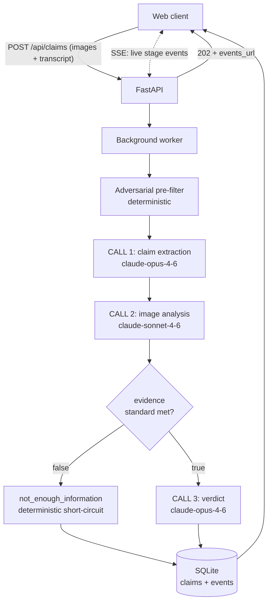

# ClaimLens

AI-powered damage claim triage. Upload photos and a claim description; a three-call LLM pipeline inspects the images, cross-checks them against the claim, and returns a structured verdict (supported, contradicted, or not enough information) with risk flags, severity, and image-grounded justification. Pipeline progress streams live to the client over SSE.

Built on the claim-verification pipeline from the [HackerRank Orchestrate hackathon](https://github.com/deshanekanayaka/hackerrank-orchestrate-june26) (June 2026, ranked #234 of 1,773), refactored from a batch CSV script into a full product backend.

---

## How it works



Design principles carried over from the original pipeline:

- **Images are the source of truth.** The transcript defines what to check; it never overrides what is visible.
- **Deterministic where possible.** Injection pre-filtering, evidence gating, history flags, schema enforcement, and the not-enough-information verdict are rule-based, not model-based.
- **Untrusted input is labelled untrusted.** Transcripts and image text are treated as claimant input; embedded instructions are flagged (`text_instruction_present`), never followed.
- **Model split by job.** Opus for reasoning (extraction, verdict), Sonnet for perception (image analysis).

## Red-team testing and defect log

The pipeline was manually red-teamed against a 12-scenario test plan covering happy paths, contradictions, adversarial inputs, image-quality failures, multi-image decoys, and API validation. Eight defects were found and fixed in one testing cycle; each fix was verified by rerunning the failing case.

| # | Defect | How it was found | Fix | Verified by |
|---|---|---|---|---|
| 1 | Stock photos and even a **sculpture of a crushed box** were approved as claim evidence (supported, severity high) | Adversarial image probes: watermarked stock photo, watermark-free stock photo, gallery artwork | Authenticity check added to the CALL 2 prompt: watermarks, staged/professional composition, and non-photographic subjects (artwork, renders, screens) now flag `non_original_image` / `possible_manipulation` and can fail the evidence gate | Sculpture now returns NEI with all three relevant flags; genuine casual phone photo passes with zero flags (false-positive guard) |
| 2 | Claim-echo: CALL 2 descriptions paraphrased the claimant's wording instead of reporting the pixels (a torn box was labelled `crushed_packaging` because the claim said "crushed") | Comparing justifications against the claim text across runs | Independent-description rule: `what_is_visible` must be written as if the claim was never read | Same image re-ran as `torn_packaging`, matching what is actually visible |
| 3 | Hallucinated requirement ID: the evidence reason cited `REQ_REVIEW_TRUST`, which does not exist in `evidence_requirements.csv` | Cross-checking cited IDs against the requirements file | Citation constraint: only requirement IDs present in the provided list may be referenced | Subsequent runs cite only real IDs |
| 4 | Vocabulary leak: CALL 2 returned `object_part=body` for a package claim; `body` is not a legal package part and nothing validated the output | A legitimate torn-parcel run | Deterministic schema enforcement in `agent.py` (`_coerce_allowed`): out-of-vocabulary `issue_type` / `object_part` values coerce to `unknown` | Unit tests (5) covering legal/illegal parts and issue types |
| 5 | Contradiction conflated with NEI: an image clearly disproving the claim failed the evidence gate as "not assessable," so the deterministic short-circuit fired and CALL 3 never got to rule `contradicted` | Scenario: shattered-screen photo submitted with a keyboard water-damage claim | Evidence-gate reframe in the CALL 2 prompt: a clear contradiction IS usable evidence (`evidence_standard_met=true` with `claim_mismatch`) | Same scenario now returns `contradicted` with the correct flags |
| 6 | Watermark text misread as a prompt-injection attempt (`text_instruction_present` fired on a stock-photo ID number) | A clean-transcript run against a watermarked image, after fix #1 raised watermark salience | Flag-taxonomy clarification: watermarks and brand text belong under `non_original_image`; `text_instruction_present` is reserved for text that directs the review | Same image re-ran with `non_original_image` only |
| 7 | **Decoy-filter bypass**: a claimant's honest comparison photo (an undamaged parcel) caused a false rejection of a real claim. The per-image flag filter worked, but the merged `risk_flags` union re-introduced the comparison photo's `damage_not_visible` into CALL 3's context | The multi-image decoy scenario | `_supporting_flags` rewrite in `agent.py`: CALL 3 receives quality flags from supporting images only, plus a MULTI-IMAGE CLAIMS rule in the verdict prompt; the full flag union is preserved in the output row for human reviewers | Same pair now returns `supported` with the comparison photo's flag visible but powerless |
| 8 | Documented boundary: clean, watermark-free reused imagery is undetectable at the prompt level | A casual-looking stock laptop photo passed with no flags | Out of scope for prompt-based detection; reverse-image lookup is on the roadmap | Recorded as a known limitation |

Two failure classes are worth naming. Defects 1 to 4 let bad evidence in (fraud risk). Defect 7 kept a legitimate claim out (false rejection), the costlier error for a real claims product, and it was only caught because the test plan included an honest claimant behaving normally: attaching a comparison photo.

Run-to-run variance was also observed and characterised: verdict-relevant fields (`claim_status`, `evidence_standard_met`) were stable across reruns; descriptive fields on rejected-evidence (NEI) claims wobbled (e.g. `dent/quarter_panel` vs `unknown/fender` for the same rejected pair). A self-consistency check on borderline CALL 2 outputs is on the roadmap.

## API

| Method | Path | Description |
|---|---|---|
| POST | `/api/claims` | Submit a claim: multipart form with `claim_object` (car, laptop, package), `user_claim` (transcript), and 1 to 6 `images`. Returns `202` with a claim ID and events URL. |
| GET | `/api/claims/{id}/events` | Server-sent events stream of live pipeline stages: prefilter, extract, analyze_images, gates, verdict, complete. |
| GET | `/api/claims/{id}` | Full claim detail: transcript, image URLs, status, and the structured verdict. |
| GET | `/api/claims` | Reviewer queue: recent claims with status, verdict, severity, and risk flags. |
| GET | `/uploads/{id}/{img}` | Submitted images. |
| GET | `/api/health` | Liveness probe. |

Example verdict payload:

```json
{
  "claim_status": "supported",
  "severity": "medium",
  "issue_type": "dent",
  "object_part": "door",
  "evidence_standard_met": "true",
  "risk_flags": "none",
  "supporting_image_ids": "img_1",
  "claim_status_justification": "A dent is clearly visible on the driver-side door in img_1.",
  "valid_image": "true",
  "evidence_standard_met_reason": "The door and claimed damage are clearly visible."
}
```

## Run it

Backend (terminal 1):

```bash
cd backend
python3 -m venv .venv && source .venv/bin/activate
pip install -r requirements.txt

cp ../.env.example ../.env   # add your ANTHROPIC_API_KEY

python -m uvicorn app.main:app --reload --port 8000
```

Frontend (terminal 2):

```bash
cd frontend
npm install
npm run dev
```

App at `http://localhost:3000` (the frontend proxies `/api` and `/uploads` to the backend, so no CORS setup is needed in dev). Interactive API docs at `http://localhost:8000/docs`.

Tests run without an API key (LLM calls are stubbed):

```bash
pytest tests/ -v
```

Note: only run `python3 -m venv .venv` once, the first time you set up the project. In later sessions just activate the existing environment with `source .venv/bin/activate` before starting uvicorn; re-running the `venv` command creates a brand-new, empty environment with none of the installed dependencies.

## Project structure

```text
backend/
├── app/
│   ├── main.py        # FastAPI routes, SSE streaming, upload validation
│   ├── service.py     # background pipeline execution, upload persistence
│   ├── db.py          # SQLite: claims + append-only stage events (WAL)
│   ├── schemas.py     # Pydantic response models
│   └── config.py      # paths, limits, CORS
├── pipeline/          # the verification pipeline (importable package)
│   ├── agent.py       # orchestrator + CALL 3 verdict, stage events, schema enforcement
│   ├── extractor.py   # CALL 1: transcript -> structured claim
│   ├── image_analyzer.py  # CALL 2: VLM perception, authenticity checks, magic-byte sniffing
│   ├── escalation.py  # deterministic gates: injection, history, evidence
│   └── utils.py       # CSV loaders
├── data/
│   └── evidence_requirements.csv
└── tests/
    ├── test_api.py    # end-to-end lifecycle test, LLM-stubbed
    └── test_agent_coercion.py  # schema-enforcement unit tests
frontend/              # Next.js 15 + TypeScript + Tailwind v4
├── app/
│   ├── page.tsx           # landing page
│   ├── submit/page.tsx    # claim submission + live pipeline run
│   ├── claims/page.tsx    # reviewer queue
│   └── claims/[id]/page.tsx  # claim record + verdict
├── components/
│   ├── PipelineChecklist.tsx  # live SSE-driven inspection checklist
│   ├── VerdictCard.tsx        # verdict stamp, findings, evidence images
│   ├── Badges.tsx
│   └── landing/               # landing-page sections (hero, case files, pipeline, hardening log)
└── lib/api.ts         # typed API client + EventSource stream reader
```

## Engineering notes

- **Live progress without a queue broker.** `process_claim` accepts an `on_stage` callback; the worker writes events to an append-only SQLite table (WAL mode) and the SSE endpoint polls it. One database, no Redis, safe across FastAPI's threadpool.
- **Non-blocking LLM calls.** The pipeline is synchronous (Anthropic SDK), so it runs as a sync background task in Starlette's threadpool, keeping the event loop free for SSE readers.
- **Upload hardening.** Client filenames are discarded (path-traversal safe) and regenerated as `img_1`, `img_2`, matching the pipeline's filename-stem image-ID convention. Real image format is sniffed from magic bytes, not extensions; AVIF is transcoded to JPEG before the vision call.
- **Failure containment.** Stage-callback errors are swallowed inside the pipeline; pipeline exceptions terminate as a recorded `failed` status with the error message, never a silent dead claim. On any CALL 3 parse or validity failure, the verdict degrades safely to `not_enough_information` rather than guessing a direction.
- **Flag routing.** The output row's `risk_flags` carries the full union across all images for human reviewers; the verdict model only ever sees flags from supporting images, so a claimant's comparison photo can never argue against their own claim (defect #7 above).

## Roadmap

- Per-IP and daily-cap rate limiting for a public demo deployment
- Reviewer queue filters (by risk flag, severity, verdict) and pagination
- Self-consistency check: run CALL 2 twice on borderline evidence and route disagreements to `manual_review_required`
- Reverse-image lookup for reused-imagery detection (closes defect #8's boundary)
- Accuracy work on the two weakest fields (issue_type, severity): few-shot examples from labelled data and an explicit severity rubric in CALL 2/3 prompts
- Optional user-history context on submission so history risk flags fire for repeat claimants
- Human review workflow: reviewer decisions recorded against the model verdict to build a correction dataset
- Deployment: Vercel (frontend) + Fly.io or Railway (API), Postgres swap-in behind the same db module